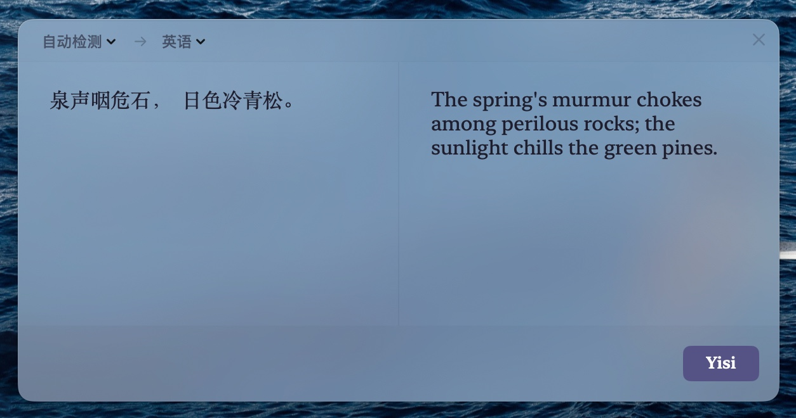

<div align="center">
  
  <h1>Yisi</h1>
  <p><b>macOS 上的智能语义转换工具</b> -- 选中、触发、呈现。不打开对话框，不切换窗口，AI 在你的操作流中无声完成转换。</p>
  <p><a href="./README.md">English</a> | 简体中文</p>
</div>

[](https://github.com/sonianmu/Yisi/releases)
[](https://github.com/sonianmu/Yisi/releases)
[](LICENSE)

---

## 截图



---

## 功能特性

- **即时翻译** -- 选中文字，按下快捷键，译文原地浮现。内置精调 Prompt，输出自然地道的译文，而非逐字机械转换
- **Learned Rules（学习规则）** -- 纠正一个术语或调整一种表达，Yisi 自动记住偏好并在后续翻译中持续应用
- **离线翻译** -- 集成 macOS 原生 System Translation，断网环境下数据完全本地处理，不经过任何服务器
- **Preset Mode（预设模式）** -- 预定义输入感知和输出指令，配置一次永久生效。选中即触发，触发即完成，零额外操作
- **Custom Mode（即时模式）** -- 一次性需求无需提前配置。触发时填写"这是什么"和"请做什么"，当场处理
- **截图识别** -- 快捷键框选屏幕区域，图片直接送入 AI 分析。设计稿、报错截图、数据图表均可处理
- **多 AI 提供商** -- 支持 Gemini、OpenAI、智谱 AI、DeepSeek、MiniMax，并支持自定义 OpenAI 兼容、Gemini 原生及 Anthropic Messages 服务；文本和视觉模型可分别配置
- **翻译历史** -- 所有转换结果本地持久化，随时回溯查阅
- **菜单栏常驻** -- 不占 Dock 位，常驻 macOS 菜单栏，随时可用
- **深色/浅色主题** -- 跟随系统或手动切换
- **自动更新** -- 应用内检查并下载新版本
- **开机自启** -- 首次启动后自动注册为登录项

---

## 设计哲学

> Yisi 没有对话框。

不是"选中内容 -> 打开对话 -> 描述需求 -> 等待回复"，而是"选中 -> 呈现"。

没有来回问答，没有对话历史，没有 AI 的名字和头像。左边是你选中的内容，右边是它的新形态。窗口关掉，一切如常，只是那件事已经完成了。

AI 不是你去拜访的对话伙伴，而是安静藏在你操作流里的一环。

---

## 环境要求

| 要求 | 最低版本 |
|------|---------|
| **macOS** | 14.0+（Sonoma） |
| **芯片** | Apple Silicon / Intel |

> **注意**：Yisi 需要辅助功能权限（Accessibility）来捕获选中文字。首次使用时系统会弹出授权提示，请在 **系统设置 > 隐私与安全性 > 辅助功能** 中授权。

---

## 快速开始

### 安装

从 [Releases](https://github.com/sonianmu/Yisi/releases) 页面下载最新的 `.dmg` 文件，拖入应用程序文件夹即可。

### 三步完成一次转换

1. **选中** -- 在任何应用中选中文字，或按截图快捷键框选屏幕区域
2. **触发** -- `Cmd + C + C`（文本）/ `Cmd + Shift + X`（截图）
3. **呈现** -- 结果在弹窗中直接显示，关闭即返回

快捷键可在 Settings > 通用 中自定义。

### 五分钟完成配置

1. 从提供商获取 API Key 和可用的模型 ID。
2. 打开 **设置 > AI 服务**，选择提供商，填写 API Key 和模型。新配置的模型默认留空，已有用户保存的模型会保留。
3. 使用其他服务时，选择 **自定义服务**，填写协议和 API 地址。模型需要特殊推理参数时，再展开 **高级适配** 调整。
4. 点击 **测试并保存**。成功后保存配置并切换为 AI 翻译；失败时显示具体错误，保留之前的配置。
5. 截图可选择系统 OCR 或 AI 视觉。AI 视觉默认开启「保持一致」复用文本服务；关闭后可使用与文本相同的厂商列表单独配置。请确保所选模型具备视觉能力。开关不再受厂商或旧版能力标记限制，不支持图片时显示服务端返回的错误。

新配置默认使用 AI 翻译；需要系统翻译时，在 **设置 > 翻译** 中手动切换引擎。未保存 API Key 和模型时，会提示配置 AI 服务或切换为系统翻译。老用户原有引擎选择会保留，直到成功保存 AI 服务。

欢迎页的 **下一步** 会先测试并保存填写的 AI 配置，再进入权限设置。测试失败时保留当前填写内容并停留在本页；**稍后配置** 则明确跳过配置。测试进行时无法切换到下一页；已经成功保存的配置可直接继续，无需重复测试。

---

## 安装问题排查

Yisi 使用临时签名，尚未经 Apple 公证，macOS 首次打开时可能显示安全警告。

**方案一 -- 右键打开**

1. 在访达中右键（或 Control-点击）`Yisi.app`
2. 从右键菜单中选择 **打开**
3. 在确认对话框中点击 **打开**

**方案二 -- 系统设置**

1. 打开 **系统设置** > **隐私与安全性**
2. 向下滚动到 **安全性** 部分，点击 **仍要打开**

**方案三 -- 终端命令**

```bash
xattr -cr /Applications/Yisi.app
```

---

## 技术栈

| 层级 | 技术 |
|------|------|
| 语言 | Swift 5.9 |
| UI 框架 | SwiftUI |
| 最低系统 | macOS 14（Sonoma） |
| 文字捕获 | Accessibility API + 剪贴板回退 |
| 截图 | ScreenCaptureKit |
| 离线翻译 | macOS System Translation |
| AI 集成 | Gemini / OpenAI / 智谱 / DeepSeek / MiniMax REST API |
| 学习引擎 | 本地规则存储 + 自动 Prompt 注入 |
| 分发 | DMG（手动构建） |

---

## 项目结构

```
Yisi/
├── .github/workflows/       # CI/CD
├── docs/                    # 设计文档
├── assets/                   # 应用图标等静态资源
├── scripts/                  # 构建和辅助脚本
├── web/                      # 官网（yisi.pages.dev）
├── Yisi/
│   ├── YisiApp.swift         # 应用入口、菜单栏、快捷键注册
│   ├── Core/
│   │   ├── AI/               # AI 服务层
│   │   │   ├── AIService.swift       # 统一 AI 调用接口
│   │   │   ├── Models.swift          # 模型定义
│   │   │   ├── Prompts/             # 翻译和转换 Prompt
│   │   │   └── Providers/           # Gemini / OpenAI / Zhipu / DeepSeek / MiniMax
│   │   ├── Capture/          # 文字捕获（Accessibility + 剪贴板）
│   │   ├── Design/           # 设计系统（主题、颜色、视觉效果）
│   │   ├── History/          # 翻译历史持久化
│   │   ├── Learning/         # Learned Rules 学习引擎
│   │   ├── Localization/     # 多语言支持
│   │   ├── Shared/           # 共享常量和配置
│   │   ├── Shortcut/         # 全局快捷键管理
│   │   ├── SystemTranslation/# macOS 原生离线翻译
│   │   └── Utils/            # 工具函数
│   └── UI/
│       ├── Components/       # 可复用 UI 组件
│       ├── Layout/           # 布局容器
│       ├── ScreenCapture/    # 截图覆盖层
│       ├── Settings/         # 设置面板 + 欢迎引导
│       ├── Translation/      # 翻译结果弹窗
│       └── Window/           # 窗口管理
├── Package.swift
└── LICENSE                   # GPL-3.0
```

---

## 从源码构建

```bash
# 克隆仓库
git clone https://github.com/sonianmu/Yisi.git
cd Yisi

# 在 Xcode 中打开 Swift Package
xed .
# 或使用命令行
swift build -c release
```

生成同时支持 Apple Silicon 与 Intel 的安装包：

```bash
VERSION=1.3.3 ./scripts/build_dmg.sh
```

输出为 `Yisi.dmg` 和 `build-app/Release/Yisi.app`。脚本不会发布 GitHub Release，也不会清除用户数据。

本机开发可使用三档启动脚本（无参数时显示帮助）：

```bash
cd ~/Desktop/Yisi
./scripts/fresh-start.sh --close   # 关闭，不清除数据
./scripts/fresh-start.sh --start   # 构建并启动，已运行时跳过
./scripts/fresh-start.sh --new     # 关闭并清除全部数据，不构建、不重新启动
```

`--new` 会关闭 Yisi，删除全部配置、API 密钥（包括 Keychain）、预设、历史数据库与截图、学习规则、修复备份、缓存、日志和 Yisi 的旧沙盒数据，再重置系统授权并退出。它不构建、不重新启动，也不删除 App 或源代码。授权重置失败不会阻止前面的数据清理；脚本会报告失败，应用仍保持关闭。可加 `--keep-keys --keep-permissions` 显式保留密钥和授权；模型与服务地址仍恢复默认。任何模式都可加 `--dry-run` 仅预览操作。清除后需启动时，另行运行 `--start`。

开发 App 位于 `build-app/Debug/Yisi.app`，日志位于 `~/Library/Logs/Yisi/`。脚本启动的开发会话暂停自动更新检查，不修改保存的更新偏好。需要加载新代码时，先 `--close` 再 `--start`。

首次迁移会注销旧 `.build_app/Debug/Yisi.app` 的应用登记，并将其保留为 `.build_app/retired.*/Yisi.app.disabled`，避免系统重启时选中旧副本。启动检查会核对实际可执行文件路径；配置和历史不受此迁移影响。

首次启动会显示欢迎引导，完成后才打开设置。录屏步骤点击“启用”会请求系统授权；若系统权限列表中未显示 Yisi，可点击“在 Finder 中显示 App”，然后在系统设置的录屏权限页面通过 `+` 选择这个 `Yisi.app`。授权生效后 App 会重新启动。开发版使用临时签名，重新构建后系统可能要求再次授权。


---

## 支持的 AI 服务

| 连接模板 | 文本 | 视觉 |
|----------|------|------|
| Gemini | 支持 | 使用支持图片输入的模型 |
| OpenAI | 支持 | 使用支持图片输入的模型 |
| 智谱 AI | 支持 | 使用支持图片输入的模型 |
| DeepSeek | 支持 | 使用支持图片输入的模型与服务 |
| MiniMax | 支持 | 使用支持图片输入的模型与服务 |
| 自定义服务 | 支持 | 使用支持图片输入的模型与服务 |

模型由用户填写，不绑定固定列表。能否调用及支持哪些功能，取决于提供商、账号、模型和协议。思考开关使用模型对应的推理适配，需要时可在高级适配中修改。自定义服务的新 API 密钥存入 Keychain。具体配置方法见 [通用模型服务配置](docs/model-services.md)。

## 更新与权限

开启“自动更新”后，Yisi 在启动时检查一次，并在运行期间每 6 小时检查一次。打开开关会开始新的 6 小时周期，关闭后停止定时检查。无论开关是否开启，都可以在“设置 → 通用 → 检查更新”中手动检查。同一个新版本只自动提醒一次，不会重复弹窗。

新版首次启动会检查版本和签名身份。版本、签名变化或从旧版首次迁移时，应用仅自动刷新当前进程实际未获授权的项目，并直接进入需要的权限步骤；已经有效的授权不会因签名变化被清除。用户无需先点击“软件修复”，API 密钥、服务配置和历史记录均保留。处理结果会被记录，普通重启不会反复重置。

macOS 仍可能要求重新确认授权；自动迁移不能代替系统确认。辅助功能引导会为当前运行的 App 发起授权请求，权限生效后自动前进；授权后重新启动会直接进入尚缺的权限步骤或主页。若自动处理失败，应用会显示提示，并提供 GitHub Issues 入口。

## 软件修复

应用出现异常时，可在“设置 → 通用”或菜单栏图标的右键菜单中选择“软件修复”。修复保留 API 密钥、服务配置、翻译历史、历史截图、预设和学习规则，只恢复外观、快捷键及窗口位置，并备份缓存和尝试恢复失效授权。确认页会提示可能丢失部分临时数据或个性化设置。备份位于 `~/Library/Application Support/com.sonianmu.yisi/RepairBackups/`。若仍无法使用，请通过 [GitHub Issues](https://github.com/sonianmu/Yisi/issues) 反馈。


---

## 贡献

欢迎贡献代码。开始之前：

1. Fork 本仓库并创建功能分支
2. 使用 Xcode 打开项目并在本地测试
3. 确保代码风格一致
4. 向 `main` 分支提交 PR，并附上清晰的变更说明

每个 PR 只包含一个功能或修复。

---

## 许可证

[GPL-3.0](LICENSE) -- Copyright (C) 2026 Sonian Mu
